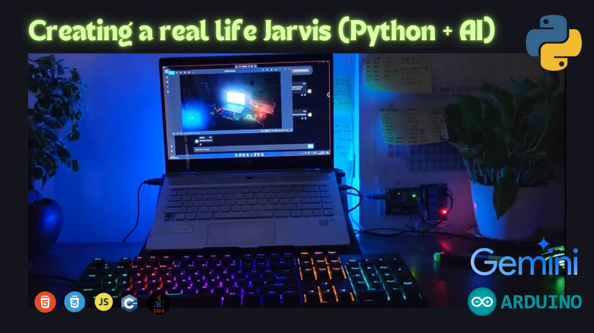

# Project Jarvis 
AI automation is 💖

Jarvis v13 is a Python-based personal assistant powered by Gemini, designed to automate tasks, answer queries, and assist with creative content generation.

## Table of Contents
- [Demo](#Demo)
- [Graphical User Interface](#Graphical-User-Interface-GIFs)
- [Technologies Used](#how-to-build)
- [How to build?](#How-to-Build)
- [Feedback and Contributions](#feedback-and-contributions)
- [License](#license)
- [Contacts](#%EF%B8%8F-contacts)
<!-- ## Features

- Light/dark mode toggle -->

## 💻 Demo

Here is a quick Demo for out personal AI Assistant.

⭐ Star us on GitHub — it motivates us a lot!
## 🔥 Graphical User Interface GIFs:

**Main Page**: With Customisable colors: Red & Blue: 

We look forward to assisting you and ensuring your experience with our products is successful and enjoyable!
## 🚀 Technologies Used

**Core AI Tech.:** Gemini

**Front End:** HTML, CSS & JS ( Integrated using eel. )

**Backend:** Python

**Hardware:** Arduino 

**Database (For FIle Transfer Function):** Android App, Firebase DB

## 📝 How to Build

--- Comming Soon ---

## 📃 License

This product is distributed under a proprietary license. You can review the full license agreement at the following link: [Standard License Agreement for Abblix OIDC Server](https://resources.abblix.com/docs/eng/standard-license-agreement-abblix-oidc-server.pdf).

For non-commercial use, this product is available for free.
## 🤝 Feedback and Contributions

Contributions are always welcome!

See `contributing.md` for ways to get started.

Please adhere to this project's `code of conduct`.

## Authors

- [@Arnav3241](https://www.github.com/Arnav3241)
- [@Avi0981](https://github.com/Avi0981)

