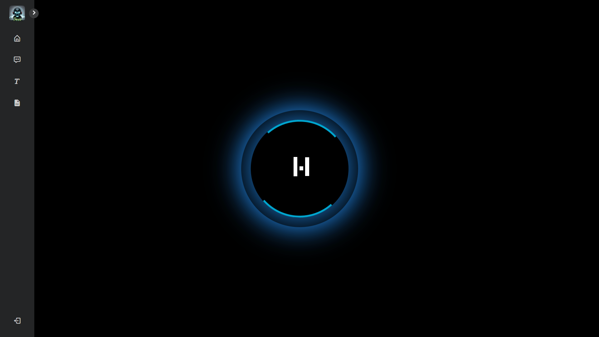
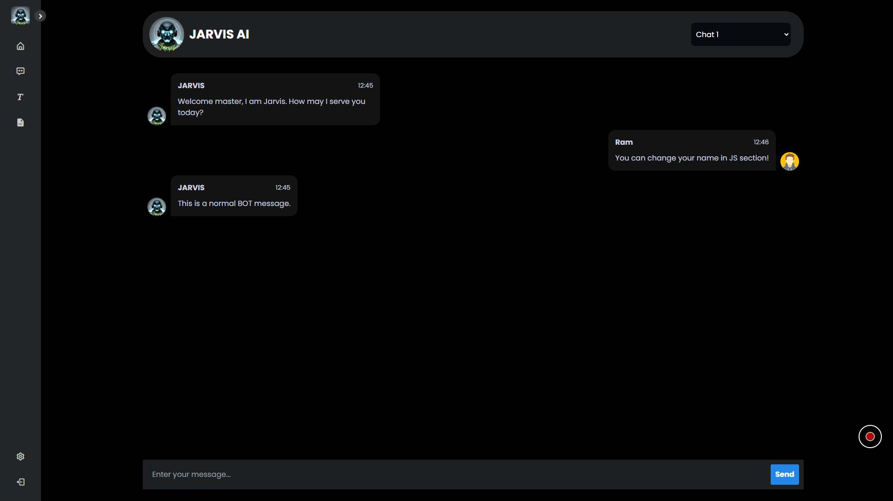

# Project Jarvis 
AI automation is 💖

Say Hi to Jarvis, Your very own personal Ai assistant! Jarvis simplifies coding, web searches, and home automation with a touch of personality. Integrated with Arduino, Jarvis is your tech-savvy ally. Explore its capabilities seamlessly through a sleek and intuitive interface. Your efficient, AI-driven sidekick for a smarter, connected lifestyle.

## Here are some GUI snippits

## To Do
 - Trello Workspace - (https://trello.com/b/B7I5aOmA/to-do)

## Feedback

If you have any feedback or want to report a bug, please reach out to us by Git Issues.

## Authors

- [@Arnav3241](https://www.github.com/Arnav3241)
- [@Avi0981](https://github.com/Avi0981)

